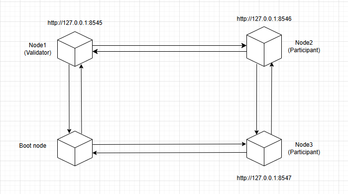
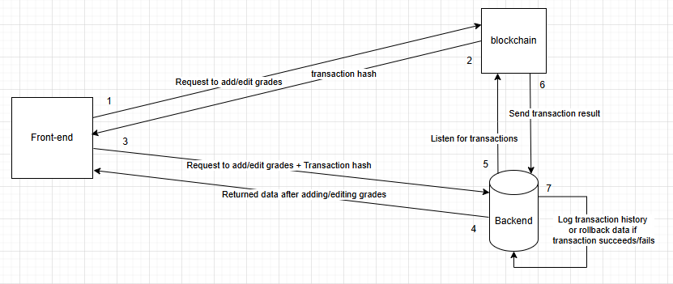

# Student Score Management and Storage System Using Blockchain
The project serves research purposes and the practice of knowledge related to blockchain and smart contracts.

<h1 align="center">
  Tech Stack
</h1>

  
  
  
  
  
    

# The design model of a private blockchain

# Data Flow

