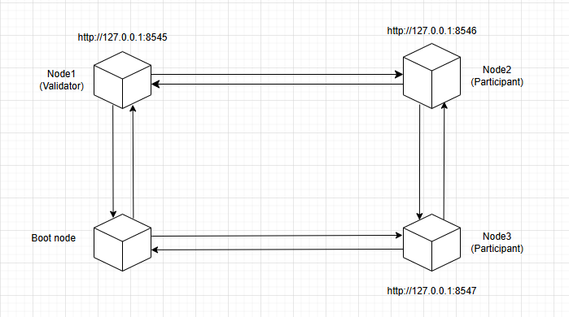
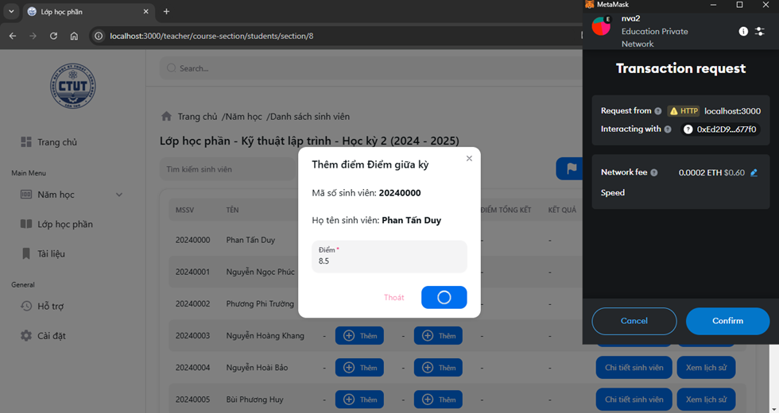
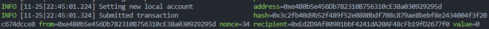
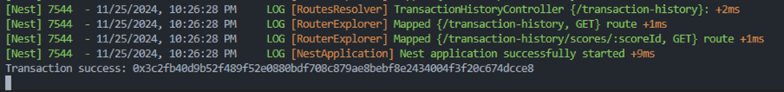
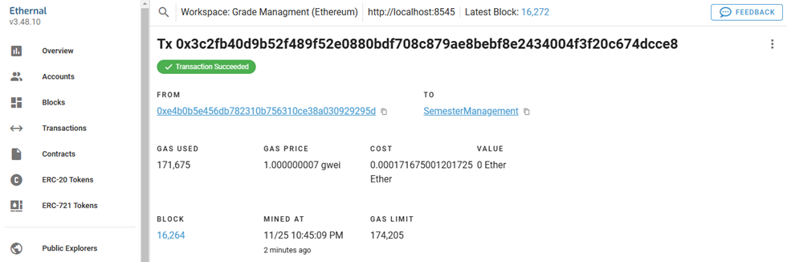

# Student Grades Management Using Blockchain
## Overview
This project serves research purposes and helps practice knowledge related to blockchain and smart contracts. In this project, I build a private blockchain using Geth to store student grades (on-chain data), while other academic-related information is stored in a MySQL database (off-chain).

Yes, this is a hybrid application that combines blockchain technology with traditional data storage. More information about the project can be found below. I hope this repository serves as a useful resource for anyone starting their journey into blockchain and the Web3 world.

If you have any ideas to contribute, feel free to connet me 😊.

# **Private Chain Architecture**

- **Type:** Private Chain ([What is a private blockchain and why use it?](https://www.dock.io/post/public-vs-private-blockchains#:~:text=A%20private%20blockchain%20is%20a%20decentralized%20ledger%20that%20is%20only,create%20data%20on%20the%20blockchain.))  
- **Consensus Mechanism:** Proof of Authority (PoA)  
- **Genesis Configuration:** See [`private-chain/genesis.json`](private-chain/genesis.json) for more details  

## **Network Node Design Model**  

# Data Execution Flow for Adding/Updating Grades

# Example Execution: Adding Score

### 1. Lecturer Signs the Transaction    

### 2. Transaction Submitted   

### 3. Backend Listens for Confirmation  

### 4. Verify on Block Explorer  

<h1 align="center">
  Tech Stack
</h1>

  
  
  
  
  
    

